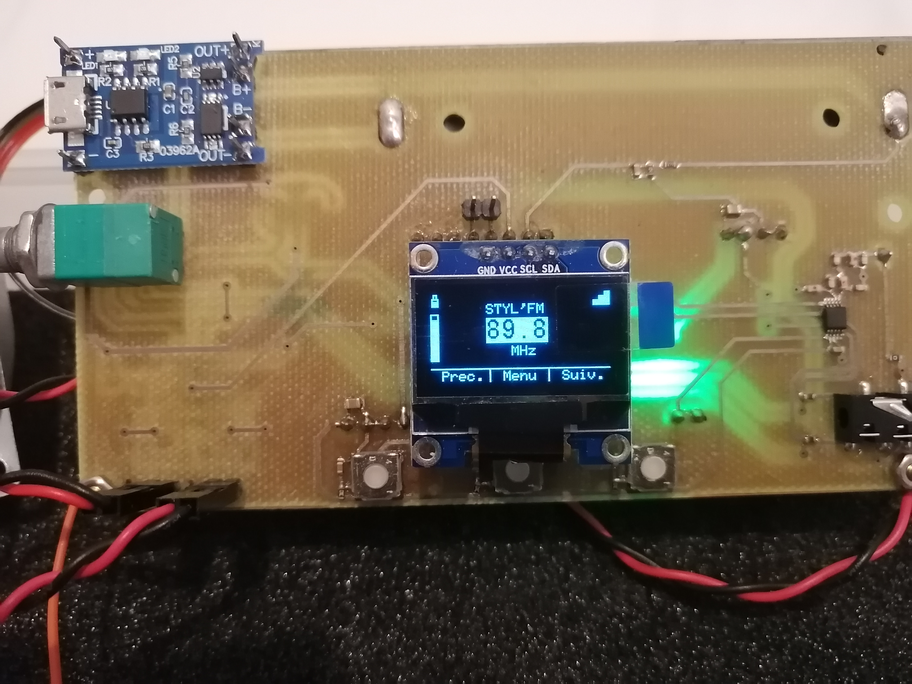
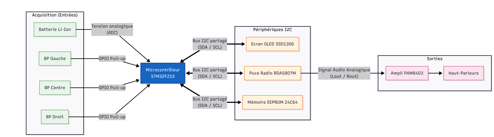
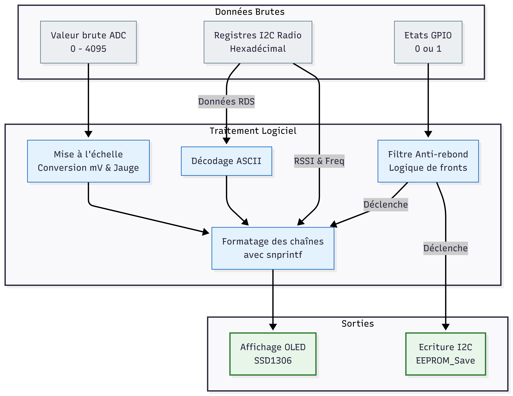
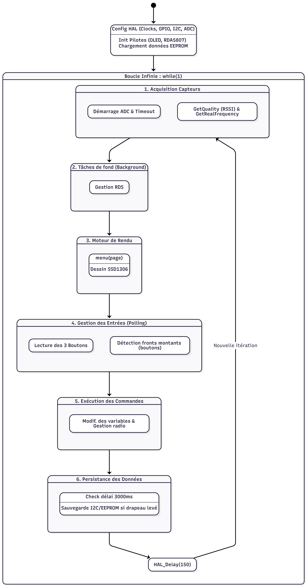
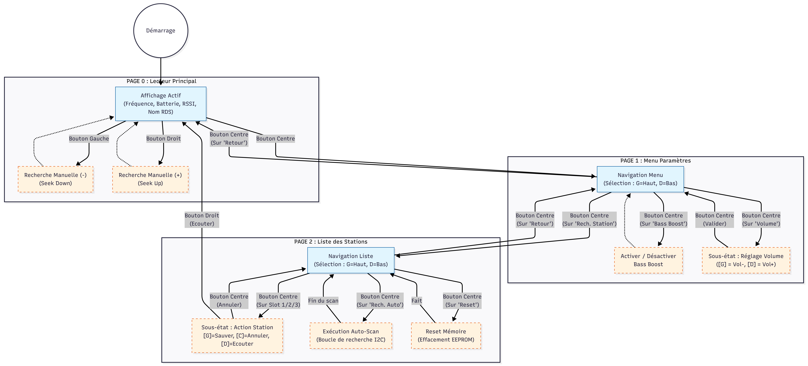

# Documentation technique : Conception d'un récepteur radio FM interactif

**Auteur :** ROMERO Tommy

## 1. Présentation Générale du Projet

Ce projet consiste en la conception et le développement complet d'un système embarqué interactif : un récepteur radio FM. Articulé autour d'un microcontrôleur de la famille STM32, le dispositif intègre une gestion matérielle avancée (puce radio) et une Interface Homme-Machine (IHM) optimisée pour des ressources contraintes.

L'objectif principal est de fournir une expérience utilisateur fluide à travers un écran OLED, tout en gérant en arrière-plan et de manière asynchrone la communication avec le module radio, la lecture des capteurs (niveau de batterie, boutons), le décodage RDS et la persistance des données (EEPROM).

## 2. Architecture Matérielle (Hardware)

Le cœur du système repose sur un microcontrôleur STM32 (32F21) programmé via l'environnement STM32CubeIDE. La première phase de ce projet a consisté à configurer précisément le microcontrôleur et à router les périphériques (Pinout & Configuration).

Le routage des périphériques a été pensé pour centraliser les communications :
* **Bus I2C Partagé :** Constitue la colonne vertébrale du système. Il relie le STM32 à trois périphériques esclaves fonctionnant en parallèle : l'écran OLED (SSD1306), la puce radio (RDA5807M) et une mémoire EEPROM (24C64).
* **Acquisition Analogique (ADC) :** Une broche est dédiée à la lecture de la tension d'une batterie, permettant d'estimer l'autonomie restante en temps réel.
* **Entrées/Sorties (GPIO) :** Configuration en entrée pour trois boutons physiques (BP1, BP2, BP3) assurant la navigation, et en sortie pour le pilotage d'indicateurs LED (RGB/User).
* **Chaîne Audio :** Le signal de sortie de la puce radio (Lout/Rout) est amplifié par un module PAM8403 (2x 3W) avant d'arriver sur les haut-parleurs.

*Image 1 : Bord du modèle et bus I2C*

*Image 2 : Diagramme des flots de données*

## 3. Architecture Logicielle et Pilotes (Drivers)

Le développement logiciel repose sur l'utilisation de la librairie HAL de STMicroelectronics, mais également sur l'utilisation de différents drivers déjà existants (via GitHub).

### 3.1. Gestion radio et traitement du signal (RDA5807)
Intégration et adaptation des fonctions permettant de piloter le récepteur FM via I2C. Le pilote radio prend en charge la configuration de la bande de fréquence, le réglage du volume, et l'extraction de données de diagnostic comme la force du signal (RSSI). Il inclut également une fonction de recherche automatique (auto-scan) intelligente, couplée à un décodage RDS en tâche de fond pour extraire dynamiquement le nom de la station écoutée.

### 3.2. Persistance des données (EEPROM 24C64)
Pour garantir une expérience utilisateur continue, l'état du système (volume, fréquence actuelle) et une liste de trois stations favorites sont sauvegardés en mémoire. Afin de préserver la durée de vie du composant I2C, une logique particulière a été implémentée : l'écriture physique n'est déclenchée que 3 secondes après la dernière manipulation utilisateur.

### 3.3. Driver d'affichage (SSD1306)
L'interface graphique est gérée par le pilote SSD1306 : Il s'agit d'une bibliothèque graphique pour l'écran OLED. Le travail consiste à utiliser des fonctions de dessin pour tracer des éléments d'interface dynamiques : barres de chargement, jauges de batterie, icônes de signal réseau, texte, etc.

Dans une optique d'optimisation de la mémoire et des cycles d'horloge, l'affichage de l'icône de batterie a été entièrement repensé. Au lieu de faire appel à des fonctions de dessin géométrique lourdes, les différents états de remplissage de la batterie ont été modélisés sous forme de caractères typographiques personnalisés. En dupliquant et modifiant le fichier de police pour créer `ssd1306_symbols.c`, les icônes de batterie (de 0% à 100%) sont directement appelées via les lettres de 'a' à 'e' issues de la matrice `Symbols_7x10`. Cette méthode permet d'afficher un état graphique complexe en une seule instruction d'écriture de chaîne de caractères, divisant drastiquement le temps d'exécution.

### 3.4. Gestion de la mémoire EEPROM
Pour assurer la persistance des données utilisateur (après un arrêt de l'appareil), un pilote spécifique a été développé pour communiquer avec la mémoire EEPROM 24C64 via le bus I2C. La mémoire ne pouvant stocker que des octets (8 bits), la sauvegarde des fréquences (variables sur 16 bits) a nécessité l'implémentation d'opérations bit à bit (via masquage logique) pour diviser et reconstituer les données lors des lectures/écritures. Le fichier `eeprom.c` regroupe les fonctions modulaires suivantes :
* `EEPROM_Save_State` et `EEPROM_Load_State` : Sauvegardent et rechargent l'état général de la radio au démarrage (volume et fréquence). Elles intègrent une sécurité attribuant des valeurs par défaut si la mémoire est détectée comme vierge (0xFF).
* `EEPROM_Save_Station` et `EEPROM_Load_Station` : Permettent de stocker jusqu'à 3 fréquences favorites grâce à un calcul basé sur l'index de la station.
* `EEPROM_Reset_Stations` : Permet d'écraser les slots mémoires avec des zéros, remettant ainsi toutes les stations à "Vide".

### 3.5. Tolérance aux pannes et codes d'erreur
Dans une optique de conception robuste, le système ne doit jamais être en erreur de manière silencieuse. Une gestion des retours de la couche HAL (`HAL_StatusTypeDef`) a été implémentée. Par exemple, dans le `main.c`, lors de la lecture de la tension de la batterie, le programme vérifie explicitement si le convertisseur ADC a terminé sa tâche dans les temps (`HAL_OK`). Si le composant ne répond pas (Timeout) ou est occupé (Busy), l'interface graphique court-circuite le calcul de tension pour afficher dynamiquement un code d'erreur (E:1, E:2, E:3) à la place des millivolts, et vide visuellement la jauge de batterie pour alerter l'utilisateur de la défaillance matérielle.

### 3.6. Décodage du signal RDS en temps réel
Afin d'améliorer l'expérience utilisateur, le projet intègre la récupération du nom de la station diffusée. Cette opération de traitement de données est gérée par la fonction `RDA_UpdateRDSName`, appelée en tâche de fond dans la boucle principale (`while` du `main.c`). La puce radio ne fournissant pas une chaîne de caractères complète, l'algorithme lit les registres matériels (Blocs B, D et F) pour récupérer les lettres diffusées deux par deux. La fonction intègre un filtrage du taux d'erreur du bloc matériel (BLERB < 2) pour ignorer les données corrompues. Les caractères valides (ASCII) sont ensuite assemblés dans une variable globale qui met à jour l'écran OLED dynamiquement avec le nom de la station sur la page principale. En cas d'erreur, ou si la fonction n'arrive pas à récupérer un nom, "Station" est laissé par défaut.

*Image 3 : Machine d'état du fonctionnement de la boucle principale*

## 4. Logique de navigation et interface (IHM)

L'interaction utilisateur est au centre du projet avec la création d'un système de menus interactifs entièrement personnalisé. La logique de navigation repose sur une machine d'états gérant trois affichages distincts :
1. **Vue Principale (Lecteur radio) :** Affiche la fréquence radio actuelle et du nom de la station si disponible, du niveau de batterie restant et de la qualité du signal en temps réel.
2. **Vue Menu (Settings) :** Permet à l'utilisateur de configurer son appareil via une liste d'options : Fonction bass boost, passage à la vue 3 (recherche de station), réglage du volume interactif. Ce menu affiche également l'état de la batterie en temps réel (et un code d'erreur en cas de problème).
3. **Vue Recherche :** Écran dédié à la sélection de station radio pré-enregistrée, ou bien permettant de lancer une recherche automatique pour remplir les emplacements de stations disponibles. Un bouton "Reset" est également présent pour remettre cette liste à zéro (état d'usine).

Le passage d'une vue à l'autre et la modification des paramètres s'effectuent via les boutons physiques. Le code intègre une gestion rigoureuse de ces entrées pour garantir une navigation réactive et sans erreurs (via les gestion des fronts montants et la confirmation d'appuis). L'interface repose sur une architecture contextuelle : le comportement des boutons est redéfini dynamiquement en fonction de la "page" ou du "sous-état" actif.

### 4.1. Modélisation de la logique de menu & boutons

*Image 4 : Machine d'état pour l'IHM et diagramme de flot d'états pour l'affichage*

### 4.2. Matrice d'états des boutons

Ce tableau récapitule le routage des actions physiques selon le contexte de l'IHM :

| Vue / Contexte Actuel | Action : Bouton GAUCHE | Action : Bouton CENTRAL | Action : Bouton DROIT |
| :--- | :--- | :--- | :--- |
| **Page 0 (Lecteur Principal)** | Recherche manuelle (Descendre la fréquence) | Basculer vers la Page 1 (Menu Paramètres) | Recherche manuelle (Monter la fréquence) |
| **Page 1 (Menu Paramètres)** | Naviguer vers le haut / l'élément précédent | Valider la sélection (Entrer dans l'option) | Naviguer vers le bas / l'élément suivant |
| **Page 1 (Sous-état: Volume)** | Décrémenter la valeur (Volume -) | Valider et sortir du réglage (Retour Navigation) | Incrémenter la valeur (Volume +) |
| **Page 2 (Liste Stations)** | Naviguer vers le haut / l'élément précédent | Valider (Entrer en mode modification) ou déclencher une fonction (Scan/Reset) | Naviguer vers le bas / l'élément suivant |
| **Page 2 (Sous-état: Modif. Station)** | Écraser la mémoire avec la station en cours (Sauvegarder) | Annuler / Valider la modification | Charger la mémoire pour écouter la station (Sélectionner) |

La particularité de cette architecture réside dans la gestion de la Page 1 (Paramètres) et de la Page 2 (Liste Stations). Au lieu de créer une nouvelle vue complète pour chaque réglage, le système utilise un sous-état. Lorsqu'une option spécifique (comme le volume) est sélectionnée via le bouton central, le système verrouille le pointeur de navigation du menu. Les boutons latéraux (Gauche/Droite) sont alors temporairement réassignés à la modification de la variable ciblée. Une nouvelle pression sur le bouton central valide la donnée, libère la variable, et restaure le comportement de navigation standard du menu, offrant ainsi une interaction utilisateur fluide et intuitive.

### 4.3. Rendu graphique dynamique du menu
L'intégralité de l'interface visuelle a été codée dans le fichier `menu.c`, qui agit comme le moteur de rendu de l'IHM. La fonction `menu(page)` est appelée à chaque itération de la boucle principale et s'appuie sur une structure conditionnelle `switch(page)` pour dessiner l'écran correspondant à l'état actuel de la machine. L'affichage repose sur le positionnement matriciel d'un curseur virtuel (`ssd1306_SetCursor`) couplé à des fonctions de rendu de chaînes de caractères (`ssd1306_WriteString`). 

Une technique d'optimisation visuelle notable concerne la navigation dans les listes : plutôt que de redessiner l'écran avec des textes inversés pour indiquer la ligne sélectionnée, le système utilise la fonction `ssd1306_InvertRectangle`. Cette approche permet de créer une barre de sélection dynamique qui vient inverser les couleurs (pixels noirs/blancs) de la zone ciblée par l'`indice_menu_1`, offrant un rendu fluide et très économe en ressources de calcul.

## 5. Bilan et compétences

La réalisation de ce projet valide la maîtrise d'une chaîne complète de développement embarqué :
* Configuration bas niveau sous STM32CubeIDE via les bibliothèques HAL.
* Mise en œuvre et débogage de bus de communication série inter-composants (I2C).
* Acquisition analogique (ADC) et traitement des données brutes.
* Conception algorithmique asynchrone (machine d'états temporelle) et optimisation de l'empreinte mémoire pour la création d'IHM sur des systèmes à ressources limitées.

## 6. Démonstration vidéo

Voici le récepteur radio en fonctionnement, illustrant la navigation dans les menus et le décodage RDS en temps réel :

https://github.com/user-attachments/assets/19f63d3d-1a36-4abc-9978-a1067e6fac4d
